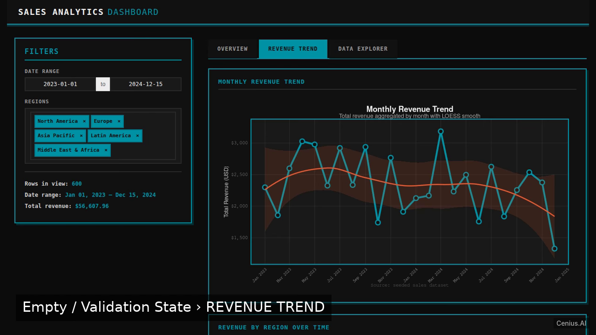
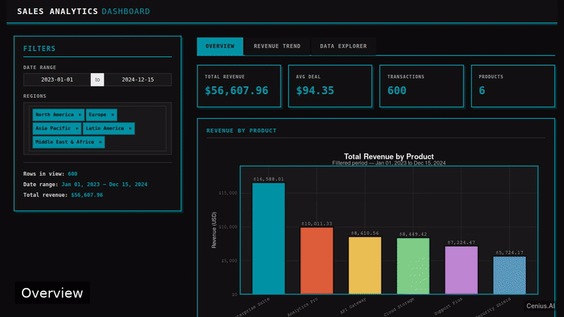
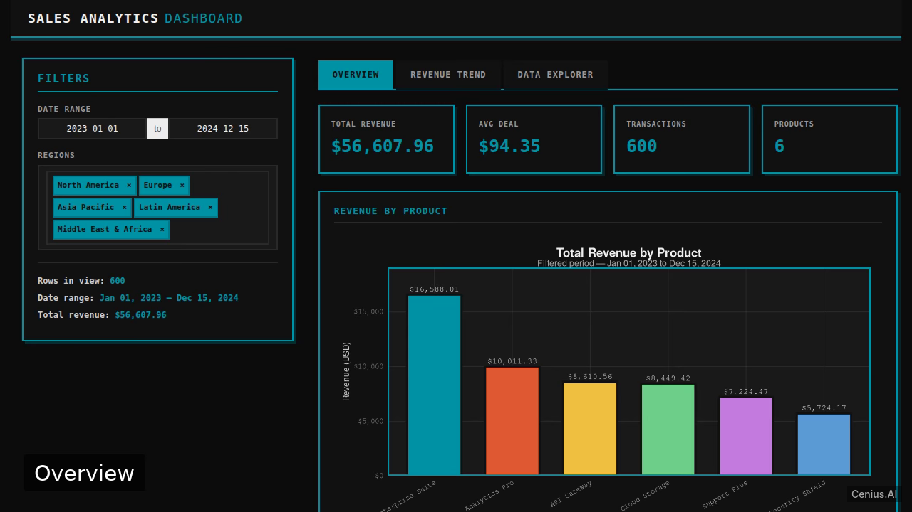
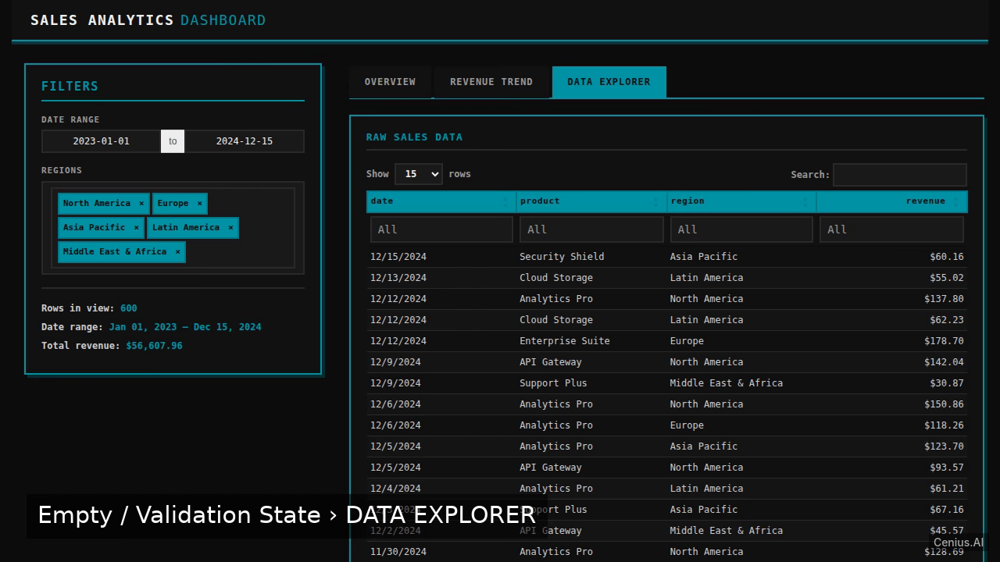

# Sales Analytics Dashboard — R/Shiny monitoring dashboard reference implementation

**Sales Analytics Dashboard** is a production-grade monitoring dashboard written in R/Shiny — generated by cenius.ai, Apache-2.0-licensed. Build an R Shiny web app that serves as an interactive sales analytics dashboard, using the tidyverse for data manipulation and visualization. Clone Sales Analytics Dashboard, run the installer, done — you have a working product in minutes. Want to change something? [Open Sales Analytics Dashboard on cenius.ai](https://cenius.ai/marketplace/p/sales-analytics-dashboard-3?ref=gh&utm_campaign=sales-analytics-dashboard) and say what you need — a revised build ships back, ready to deploy.


[](LICENSE)  [](https://cenius.ai)

[](https://cenius.ai/marketplace/p/sales-analytics-dashboard-3?ref=gh&utm_campaign=sales-analytics-dashboard)

> **▶ [Open & edit in cenius.ai](https://cenius.ai/marketplace/p/sales-analytics-dashboard-3?ref=gh&utm_campaign=sales-analytics-dashboard)** — one click to an editable workspace: describe changes in plain English, get an instant preview, one-click deploy and host. Modifications made on the platform come with full rebrand & relicense rights.

_Local clone? See [Quick start](#quick-start) below. cenius.ai is the zero-setup path._

## Demo





▶ **[Full demo walkthrough](https://cenius.ai/marketplace/p/sales-analytics-dashboard-3?ref=gh&utm_campaign=sales-analytics-dashboard)** — watch it on the project page · [download MP4](.github/media/demo.mp4)

## Screenshots

  

## Quick start

```bash
./install.sh   # installs dependencies + seeds demo data
```

See [`INSTALL.md`](INSTALL.md) for full setup and usage instructions.

## Usage guide

### Starting the App

After installation, run:

```bash
Rscript app.R
```

The console will display a URL (commonly `http://localhost:3838`). Open that address in a web browser.

### Interacting with the Dashboard

- **Sidebar**:  
  - **Region filter**: Select one or more regions to subset the data.  
  - **Date range filter**: Choose a start and end date to narrow the period.

- **Main panel**:  
  - **Revenue bar chart**: A ggplot2 bar chart showing total revenue per product for the selected region(s) and dates.  
  - **Summary table**: A dplyr-aggregated table with product-level details (e.g., total revenue, units sold).

Adjust the filters; the chart and table update reactively. The underlying data is seeded within the app and does not require any external database or file.

_Full guide: [`USAGE.md`](USAGE.md)_

## Features

- Overview Dashboard with Filters and Visualization
- Seeded Demo Sales Data
- Shiny App Entrypoint
- Installation Script
- Revenue Trend Page
- Data Explorer Page

## Architecture

The repository contains 25 files of R/Shiny source, organised under `www/`. `install.sh` provisions dependencies and seeds demo data so the app starts with something real to explore. For environment-specific setup, see [`INSTALL.md`](INSTALL.md).

## FAQ

### What's the quickest way to self-host Sales Analytics Dashboard?

`git clone` + `./install.sh` gets you a running instance — the install script provisions dependencies and demo data. Full steps live in [`INSTALL.md`](INSTALL.md); nothing external is needed to try it.

### Does the Sales Analytics Dashboard license allow commercial use?

Yes. The code is Apache-2.0-licensed — use it, modify it, and ship it commercially. See [LICENSE](LICENSE).

### How is Sales Analytics Dashboard built technically?

The app is built with R/Shiny. What you see in this repo is the full production source, demo data included. Highlights include installation Script.

### What if I want to add features to Sales Analytics Dashboard without coding?

Describe what you want changed on [cenius.ai](https://cenius.ai/marketplace/p/sales-analytics-dashboard-3?ref=gh&utm_campaign=sales-analytics-dashboard) — no code editing needed; the platform produces a fresh build you can download and deploy.

### Can I rebrand or white-label Sales Analytics Dashboard?

Yes. You can edit the source directly under the MIT license, or [remix it on cenius.ai](https://cenius.ai/marketplace/p/sales-analytics-dashboard-3?ref=gh&utm_campaign=sales-analytics-dashboard) — the platform route grants full rebrand and relicense rights over your derivative.

## License & rebranding

Released under the [Apache License 2.0](LICENSE) (© 2026 Cenius AI) — free for personal and commercial use. The Cenius name/logo are trademarks (see NOTICE).

**Need a customized version?** [Remix this app on cenius.ai](https://cenius.ai/marketplace/p/sales-analytics-dashboard-3?ref=gh&utm_campaign=sales-analytics-dashboard) — modifications made on the platform come with **full rebrand & relicense rights** over your derivative.

## Built with cenius.ai

This entire application — code, design, seeded demo data — was generated on **[cenius.ai](https://cenius.ai)** from a plain-English description.

- 🚀 [Build your own app on cenius.ai](https://cenius.ai)
- 🎛️ [Remix Sales Analytics Dashboard on the marketplace](https://cenius.ai/marketplace/p/sales-analytics-dashboard-3?ref=gh&utm_campaign=sales-analytics-dashboard) — open it in a workspace, prompt for changes, and ship your own version.

More open-source apps: [the Cenius-ai catalog](https://github.com/Cenius-ai) · [showcase index](https://github.com/Cenius-ai/showcase)
